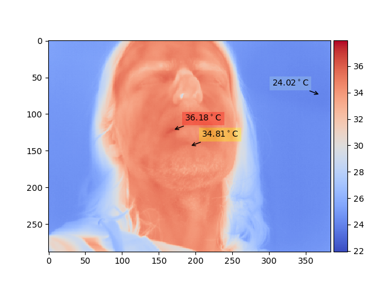
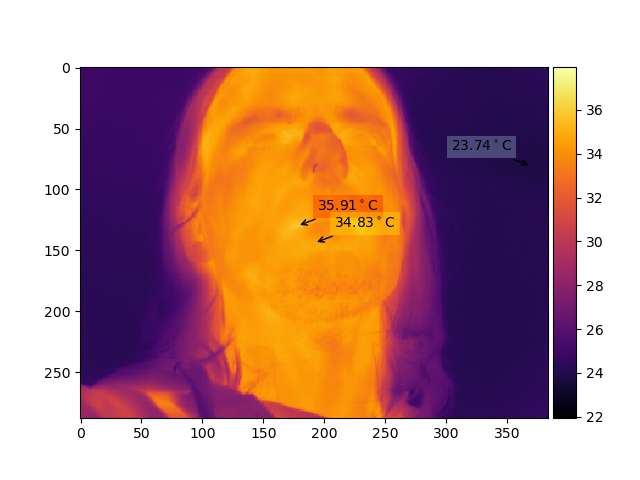
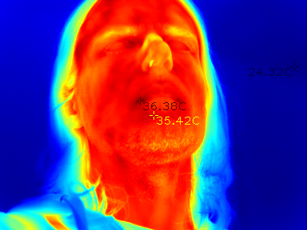

# ht301_hacklib
ht-301 thermal camera opencv python lib.

It's a very simple hacked together lib, might be useful for somebody,

uses `matplotlib` which is a little bit on the slow side,
or pure `opencv` - much faster but without most features

Tested on ubuntu 20.04:

```
$ ./pyplot.py
keys:
    'h'      - help
    ' '      - pause, resume
    'u'      - calibrate
    't'      - draw min, max, center temperature
    'a', 'z' - auto exposure on/off, auto exposure type
    'w'      - save to file date.png
    ',', '.' - change color map
    left, right, up, down - set exposure limits
```



```
$ ./opencv.py
```

